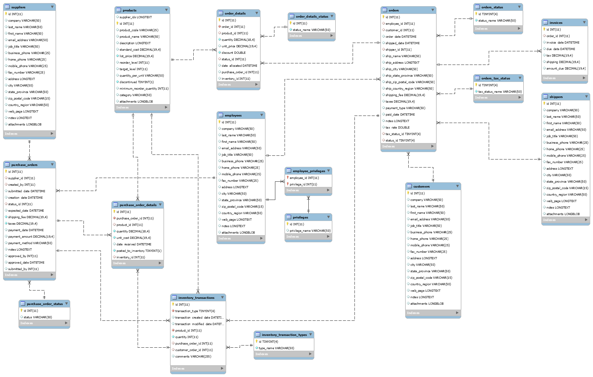

## SQL voor Developers

In de database directory tref je de MySQL export aan
(gezipt) om de zogenaamde "Northwind" database op je
systeem te vullen. Dit is dezelfde database die 
W3Schools in hun SQL tutorial gebruikt.

